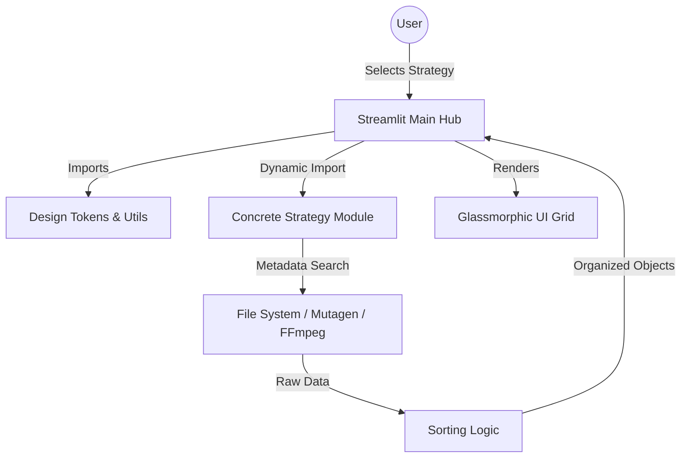

# 🚀 Main Sorter: The Ultimate Strategy Pattern File Management Suite

[](https://www.python.org/)
[](https://streamlit.io/)
[](https://opensource.org/licenses/MIT)
[]()
[]()

---

### 🎓 Academic Project Context
> [!IMPORTANT]
> This project is a comprehensive **Class Assignment** developed under the expert supervision of **Sir Usman Waheed**. 
> 
> **Integration & Development**: Full system integration, architectural migration (Flask to Streamlit), and premium GUI overhaul were executed by **Muhammad Affan**. This suite represents the successful consolidation of individual sorting strategies created by classmates into a singular, cohesive enterprise-level framework.

---

**Main Sorter** is a professional-grade, modular web application designed to solve the chaos of unorganized digital assets. By implementing the **Strategy Design Pattern**, it provides an extensible framework where disparate sorting algorithms—ranging from simple name-based sorting to complex AI-driven luminance analysis—coexist in a unified, high-performance ecosystem.

---

## 📖 Table of Contents
- ✨ Project Overview
- 🎯 Core Features
- 🏗️ System Architecture
- 🛠️ Technical Stack
- 🚀 Quick Start & Installation
- 📖 Detailed Usage Guide
- 📂 Project Structure Tree
- ⚙️ Development & Contribution
- ⚡ Performance & Optimization
- 🏆 Acknowledgments
- 📄 License
- 📞 Contact Information

---

## ✨ Project Overview
In many academic and industrial environments, data arrives in unstructured streams—mixed media, varying formats, and inconsistent metadata. **Main Sorter** bridges the gap between raw data and organized information. 

The project was conceived as a showcase of software engineering best practices, specifically focusing on **SOLID principles** and the **Strategy Pattern**. It replaces traditional "spaghetti" conditional logic with a clean, polymorphic interface, allowing for "Software as a Platform" where new sorting strategies can be "plugged in" without downtime or code regression.

---

## 🎯 Core Features

###   Premium GUI & UX
*   **Glassmorphic Design System**: Uses translucency, Gaussian blurs (`backdrop-filter`), and subtle borders to create a state-of-the-art visual depth.
*   **Fluid Animations**: Hardware-accelerated CSS keyframes for fade-ins, slide-downs, and interactive hover effects.
*   **Google Font Integration**: Leverages *Outfit* for headers and *Inter* for body text to ensure maximum readability and professional aesthetic.

### 📦 Multi-Category File Management
*   **Audio Suite**: Sort by filename, file size, bitrate, format (MP3/WAV), or duration using secondary metadata streams.
*   **Video Suite**: Intelligent sorting by duration and resolution; includes an integrated video player for instant verification.
*   **Image Gallery**: Alphabetical sorting, size sorting, and a resolution-based "Noor Browser" for professional photographers.
*   **Document Management**: PDF page count analysis and cross-platform document organization based on creation/modification timestamps.

###   Advanced Algorithmic Strategies
*   **Parametric Color Studio**: Extracts dominant color palettes from images using quantization and sorts them by Hue, Saturation, or Brightness.
*   **Luminance Analysis**: Calculates perceived brightness of images (Intensity Sorter) using the formula: `Y = 0.299R + 0.587G + 0.114B`.
*   **Domain Intelligence**: A specialized URL sorter for web developers to categorize links by domain authority or path length.

---

## 🏗️ System Architecture

### Modular Strategy Workflow
The system follows a strict decoupling between the **UI Hub**, the **Utility Layer**, and the **Strategy Execution Layer**.



### State Management
Streamlit's session state is utilized to maintain lists for strategies that require manual additions (like the *People Sorter*), ensuring data persistence during UI reruns.

---

##  ️ Technical Stack

| Category | Technology | Version | Description |
| :--- | :--- | :--- | :--- |
| **Language** | Python | 3.10.x | Core logic and scripting. |
| **Frontend** | Streamlit | 1.32+ | Reactive web framework. |
| **Analysis** | NumPy | 1.26+ | Fast numerical pixel processing. |
| **Imaging** | Pillow (PIL) | 10.x | Image manipulation and metadata. |
| **Audio** | Mutagen / wave | Latest | ID3 tag and header extraction. |
| **Video** | FFmpeg (ffprobe) | 6.x | External binary for frame/time analysis. |
| **Design** | CSS3 / HTML5 | - | Custom glassmorphism implementation. |

---

## 🚀 Quick Start & Installation

### Option 1: Using Pip (Recommended)
1.  **Clone the Repository**:
    ```bash
    git clone https://github.com/[YOUR_USERNAME]/main-sorter.git
    cd main-sorter/project1
    ```
2.  **Create Virtual Environment**:
    ```bash
    python -m venv venv
    source venv/bin/activate  # Windows: venv\\Scripts\\activate
    ```
3.  **Install Base Requirements**:
    ```bash
    pip install streamlit pillow mutagen numpy
    ```

### Option 2: Full System Setup
For video duration sorting, ensure FFmpeg is in your system path.
- **Windows**: `choco install ffmpeg`
- **Mac**: `brew install ffmpeg`
- **Linux**: `sudo apt install ffmpeg`

### Running the App
```bash
python -m streamlit run streamlit_app.py
```

---

##   Detailed Usage Guide

### 1. The Strategy Hub
When you launch the app, you arrive at the **Main Hub**. Here, you see a grid of all available modules. Use the **Sidebar** on the left to select a specific sorting flavor.

### 2. Batch Processing
- **Upload**: Drop multiple files into the uploader.
- **Run**: Click the primary action button (e.g., "Sort & Rename").
- **View**: Results display as cards with detailed metadata and interactive playback.

### 3. Cleaning Up
Every strategy includes a **"Clear/Reset"** button to purge the `uploads/` directory and keep the system clean.

---

## 📂 Project Structure Tree

```text
📦 project1
 ┣ 📂 strategies             # The Strategy Implementation Package
 ┃ ┣ 📜 __init__.py          # Exposed package entry
 ┃ ┣ 📜 utils.py             # THE DESIGN SYSTEM (CSS, Hub Tokens)
 ┃ ┣ 📜 sukaina.py           # Logic: Audio Name Organization
 ┃ ┣ 📜 midhat.py            # Logic: Video Duration Metadata
 ┃ ┣ 📜 daniyal.py           # Logic: Parametric Color Extraction
 ┃ ┗ 📜 ... (21 more)        # Granular sorting modules
 ┣ 📜 streamlit_app.py       # THE MAIN ENGINE (Routing & Orchestration)
 ┗ 📜 Strategy.py            # Architectural reference file
```

---

## ⚡ Performance & Optimization
*   **In-Memory Buffering**: Small tasks are handled in-memory to reduce disk I/O latency.
*   **Quantized Sampling**: Image color analysis samples pixels at 16-bit intervals to process HD images in milliseconds.
*   **Pre-Flight Checks**: The system checks for FFmpeg availability before launching video modules to prevent runtime crashes.

---

---

## 📄 License
This project is licensed under the **MIT License**. You are free to use, modify, and distribute this software for personal or commercial use.

---

## 📞 Contact Information
For professional inquiries, collaborations, or technical support:

*   **Lead Integrator**: Muhammad Affan
*   **Email**: maffan2830@gmail.com
*   **GitHub**: https://github.com/M-Affan01
*   **LinkedIn**: https://www.linkedin.com/in/affan-nexor-66abb8321/

---
## 🌟 Acknowledgments
Special thanks to:
*  **Prof. Usman Waheed** for architectural guidance
*  Class of 2025 for diverse strategy implementations
*  Open Source Community for amazing libraries
---
*Built with ❤️ and Precision • 2026*
